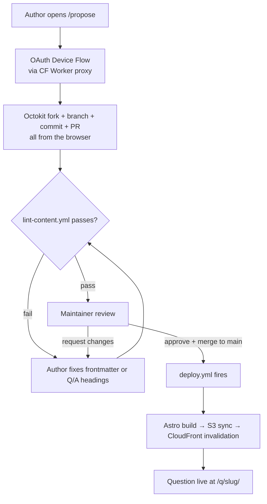
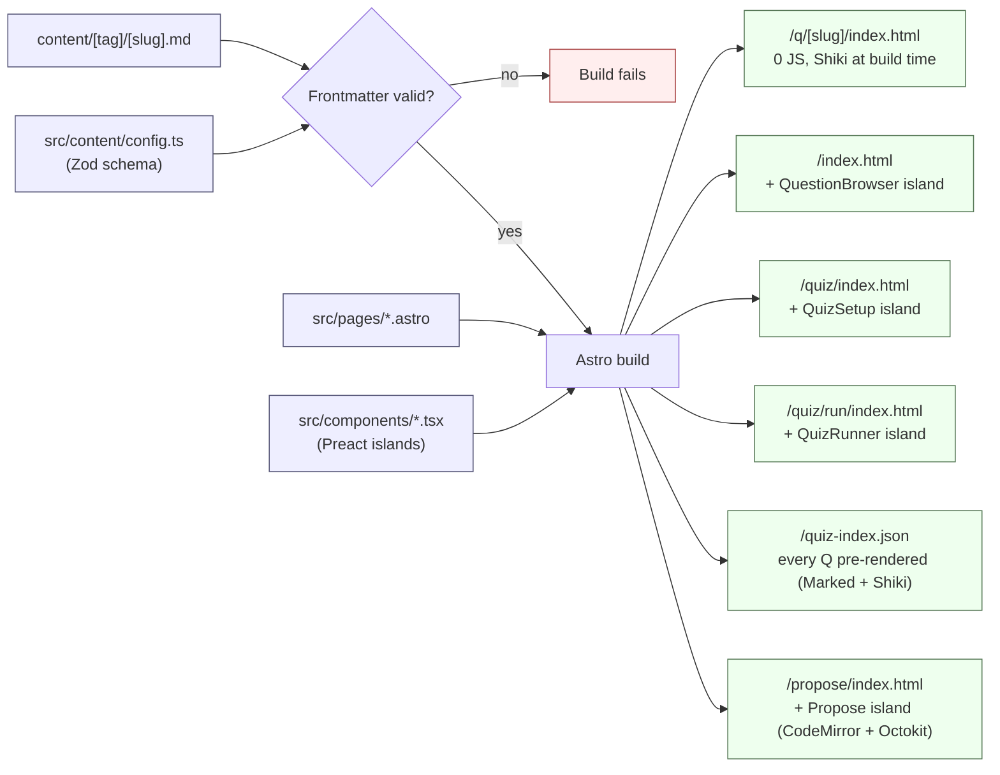
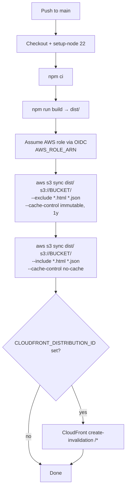
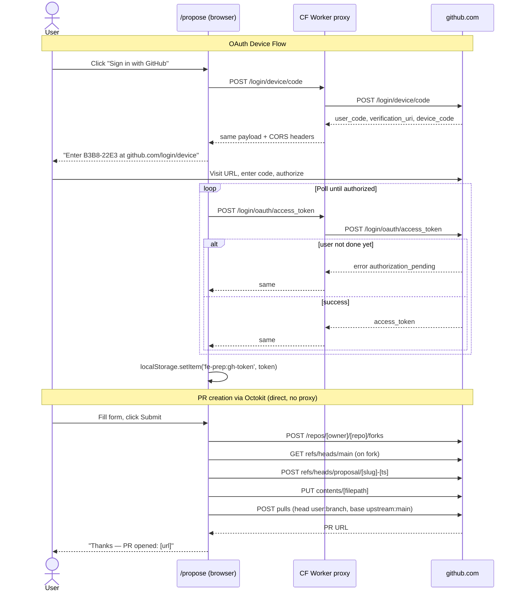
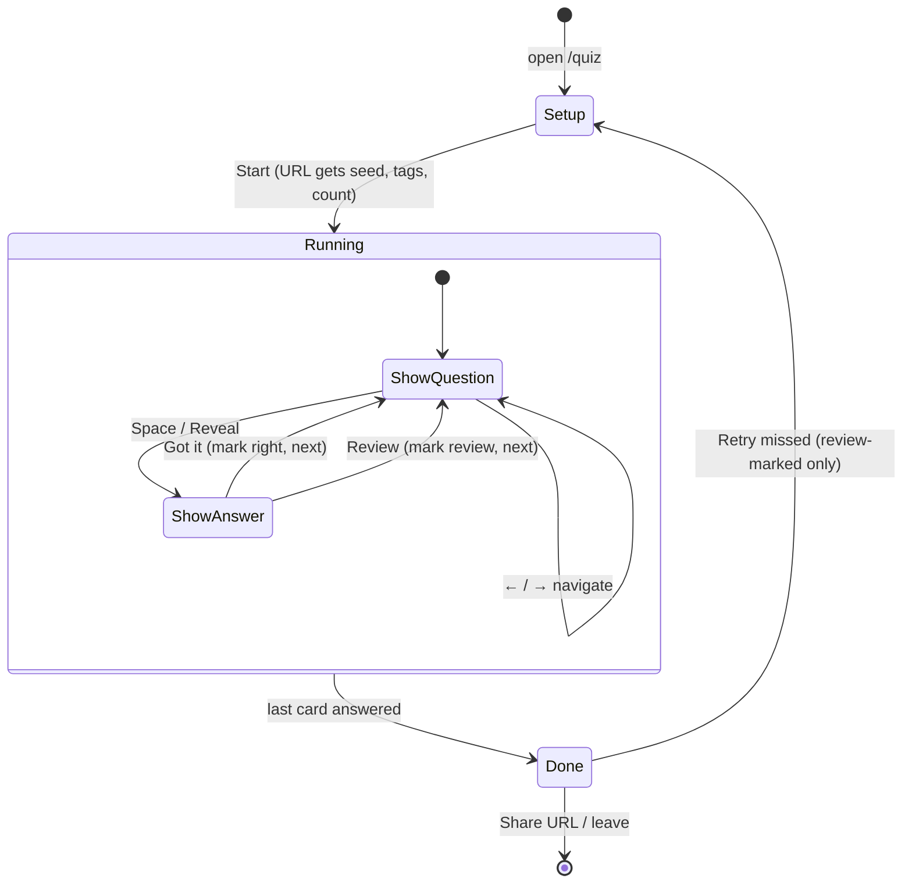
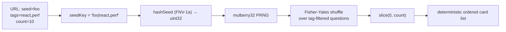

# Process diagrams

Visual companions to [ARCHITECTURE.md](ARCHITECTURE.md). GitHub renders mermaid
inline, so these display when this file is viewed on github.com.

Conventions used below: `[slug]`, `[tag]`, `[owner]`, `[repo]` are placeholders.
`/q/[slug]/` means a literal path with `[slug]` substituted.

---

## 1. Content lifecycle (author → live)

End-to-end: from someone writing a question on `/propose` to it being readable
at `/q/[slug]/`. The only piece of always-on infrastructure in this path is the
Cloudflare Worker that proxies GitHub's OAuth endpoints.

---

## 2. Build pipeline

What `npm run build` (and the deploy workflow) produces from the source tree.
Frontmatter is Zod-validated at build time; a bad question fails the build
before anything ships.

---

## 3. Deploy workflow (`.github/workflows/deploy.yml`)

Triggered on push to `main`. Uses OIDC to assume an AWS role (no static keys in
GitHub Secrets) and runs `aws s3 sync` twice — once for hashed assets with a
1-year immutable cache, once for HTML/JSON with `no-cache` so content updates
appear instantly after CloudFront invalidation.

---

## 4. Question proposal — OAuth Device Flow + PR creation

The Cloudflare Worker exists only because GitHub's two OAuth endpoints don't
send CORS headers. Once a token is in `localStorage`, all subsequent GitHub
calls go directly from the browser via Octokit (the GitHub API endpoints *do*
send CORS headers; only the `login/...` endpoints don't).

---

## 5. Quiz runtime

The `/quiz` page is a setup form. Submitting it navigates to `/quiz/run/` with
a seed, a tag CSV, and a count in the URL. Everything after that is pure
client-side off a single fetched JSON file.

### Why share URLs reproduce the same quiz

The card order is a pure function of the URL parameters. Open the same URL on
any machine: identical cards, identical order. No server, no shared state.

